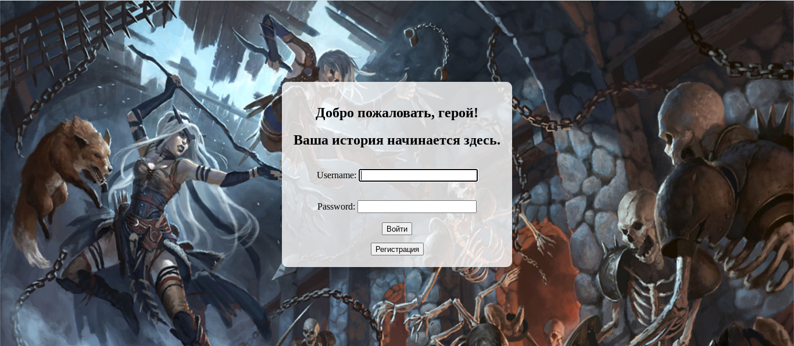
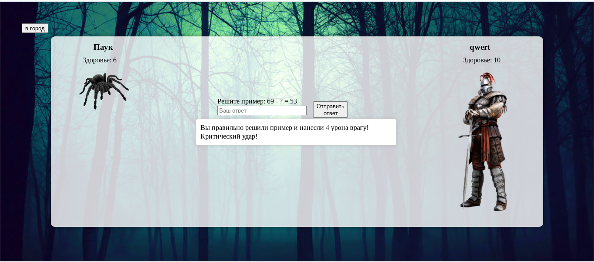

# combats_mathe_web


CombatSkinter Web ist die Webversion eines pädagogischen Mathematikspiels für Kinder.  
Der Spieler bekämpft Gegner, indem er Matheaufgaben löst. Richtige Antworten verursachen Schaden, Siege bringen Erfahrungspunkte (XP) und Gold, mit denen Ausrüstung gekauft und Attribute verbessert werden können.

---

## Funktionen
- Mathematische Aufgaben: Addition, Subtraktion, Multiplikation, Division
- Rundenbasiertes Kampfsystem (Antwort → Schaden)
- Levelsystem mit XP und Attributsteigerung
- Shop für Waffen und Rüstungen
- Browser-basiert, spielbar ohne Installation
- Backend: Django (Python)
- Frontend: HTML, CSS, JavaScript

---

## Screenshots



---

## Installation (lokal)

### Voraussetzungen
- Python 3.10 oder neuer
- Django 4.0 oder neuer
- Virtuelle Umgebung empfohlen

### Setup
```bash
git clone https://github.com/Mordvinov-ua/mathe.git
cd combat-skinter-web
python -m venv venv
# macOS / Linux
source venv/bin/activate
# Windows
venv\Scripts\activate
pip install -r requirements.txt
python manage.py migrate
python manage.py runserver